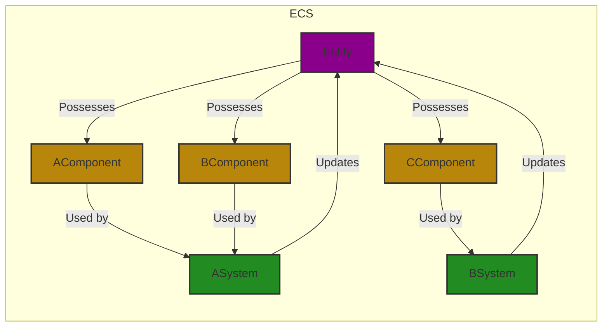

# Game Engine User Documentation

Welcome to the **Game Engine** documentation! This guide will explain how to use the engine to create, update, and manage entities, components, and systems for your game development. You don't need to know how the engine works internally; this guide will focus on the practical aspects of using the engine for your game.

---

## Table of Contents

1. [Getting Started](#getting-started)
2. [Diagram](#diagram)
3. [Creating Entities](#creating-entities)
4. [Adding Components to Entities](#adding-components-to-entities)
   - [TransformComponent](#TransformComponent)
   - [VelocityComponent](#velocitycomponent)
   - [SpriteComponent](#spritecomponent)
5. [Working with Systems](#working-with-systems)
   - [MovementSystem](#movementsystem)
   - [InputSystem](#inputsystem)
6. [Running the Game Loop](#running-the-game-loop)
7. [Customizing Keybinds](#customizing-keybinds)
8. [Handling Sound and Music](#handling-sound-and-music)
9. [Conclusion](#conclusion)

---

## Getting Started

To get started with the game engine, you will need:

- A C++ compiler.
- SFML library installed.
- Your project set up to link with the game engine.

Once everything is set up, you can start creating entities, adding components, and using systems to build your game.

---

## Diagram



### Diagram Description

The diagram illustrates the fundamental structure and relationships within the Entity-Component-System (ECS) architecture

#### Components of the Diagram:

**Entity**:

- Represented as a central node labeled "Entity".
- An entity is an object within the game or application. It acts as a container that can hold various components, allowing for flexible composition.
- An entity itself doesn't contain behavior; it merely serves as a unique identifier for a collection of components.

**Component**:

- The diagram shows multiple components connected to the entity, such as `B[Component]`, `C[Component]`, and `D[Component]`.
- Components are data structures that hold specific attributes or functionalities. Examples include:
  - **TransformComponent**: Stores position, rotation, and scale data.
  - **HealthComponent**: Holds health-related data.
  - **SpriteComponent**: Contains graphical information.
- Each entity can possess one or more components, allowing for varied and complex behavior.

**System**:

- Shown as nodes `E[System]` and `F[System]`, these represent the logic that operates on entities possessing certain components.
- Systems are responsible for updating and processing entities based on the components they contain. For example:
  - **RenderSystem**: Updates the visual representation of entities with graphical components.
  - **PhysicsSystem**: Handles the movement and interactions of entities with physics-related components.
- Systems act on groups of entities, typically during a game loop or an update cycle.

**Relationships**:

- **Possesses**: Arrows pointing from the entity to the components indicate that an entity can possess multiple components. This shows the composition relationship.
- **Used by**: Arrows from the components to the systems indicate that systems utilize these components to perform their logic. For instance, a `RenderSystem` uses `SpriteComponent` to render the visual representation of entities.
- **Updates**: Arrows from systems back to the entity indicate that systems update the state of entities based on their components. This bidirectional relationship signifies that entities are continuously modified during gameplay.

## Creating Entities

Entities are the building blocks of your game. Each entity can represent anything in the game world, such as a player, enemy, or object. Here's how to create an entity:

```cpp
auto player = _entityManager.createEntity(*id_number*, *numClient*);
auto enemy = _entityManager.createEntity(*id_number*, *numClient*);
```

Each entity has a unique ID and can hold multiple components.

---

## Adding Components to Entities

Components define the properties of an entity, such as its position, velocity, and appearance. Below are examples of how to add different components to an entity.

### TransformComponent

The `Transform` defines the X and Y coordinates of an entity in the game world.

```cpp
_componentManager.addComponent<component::TransformComponent>(player->getId(), 100.0f, 200.0f);
```

### VelocityComponent

The `VelocityComponent` controls the speed and direction of an entity's movement.

```cpp
_componentManager.addComponent<component::VelocityComponent>(player->getId(), sf::Vector2f(50.0f, 0.0f));
```

### SpriteComponent

The `SpriteComponent` allows you to assign a sprite (texture) to an entity, making it visible on the screen.

```cpp
auto& sprite = _componentManager.addComponent<component::SpriteComponent>(player->getId());
sprite.setTexture(texture);  // Assuming 'texture' is an sf::Texture loaded earlier
```

---

## Working with Systems

Systems are responsible for updating entities that have certain components. The engine provides several built-in systems such as the `MovementSystem` and `InputSystem`.

### MovementSystem

The `MovementSystem` handles the movement of entities with a `TransformComponent` and `VelocityComponent`. To ensure entities move as expected, the system is updated on each frame.

```cpp
_movementSystem.update(deltatime, entities, this->msgToSend, this->msgReceived, _entityMutex);
```

### InputSystem

The `InputSystem` handles user input for entities that have an `InputComponent`. You can map keys to actions, such as moving the player or firing a weapon.

```cpp
_inputSystem.update(deltatime, entities, this->msgToSend, this->msgReceived, _entityMutex);
```

---

## Running the Game Loop

The game loop is the core of your game. It updates all systems, processes events, and renders the entities. Here's a simple example of how to run the game loop:

```cpp
void game::GameLoop::run()
{
    while (_window.isOpen())
    {
        processEvents();
        update();
    }
}

void game::GameLoop::update()
{
    float deltaTime = _clock.restart();
    _systemManager.update(deltatime, entities, this->msgToSend, this->msgReceived, _entityMutex);
}
```

Make sure to integrate your systems inside the `update()` function so that they process each frame.

---

## Customizing Keybinds

To customize key bindings for your game, you can assign actions to specific keys in the `InputComponent`. For example:

```cpp
auto& input = _componentManager.addComponent<component::InputComponent>(player->getId());
input.bindKey("MoveUp", sf::Keyboard::W);
input.bindKey("MoveDown", sf::Keyboard::S);
input.bindKey("MoveLeft", sf::Keyboard::A);
input.bindKey("MoveRight", sf::Keyboard::D);
```

These keys can then be processed in the `InputSystem` to control entity actions.

---

Make sure each entity with a `SpriteComponent` is drawn in the window during each frame.

---

## Handling Sound and Music

For adding sound effects and music, the engine provides `SoundComponent` and `MusicComponent`. Here’s how to add them to an entity:

```cpp
_componentManager.addComponent<component::SoundComponent>(player->getId(), "PathToSound");
_componentManager.addComponent<component::MusicComponent>(player->getId(), "PathToMusic");

game.getSystemManager().addSystem<ECS_system::AudioSystem>(game.getComponentManager());
```

You can then use the `AudioSystem` to play these sounds when needed.

---

## Conclusion

This game engine allows you to manage entities, components, and systems easily without needing to dive deep into the engine's internal workings. With this flexible and modular design, you can add new features, mechanics, and components with minimal effort.

Happy game development!
