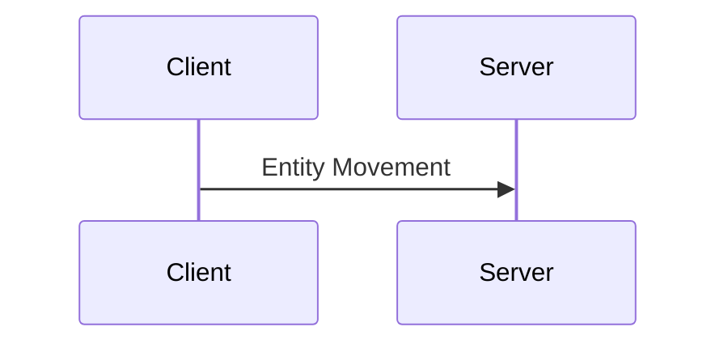
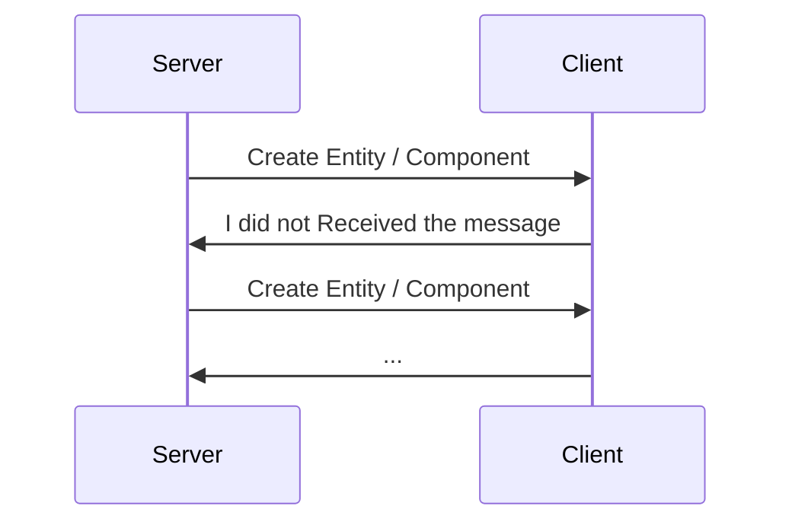
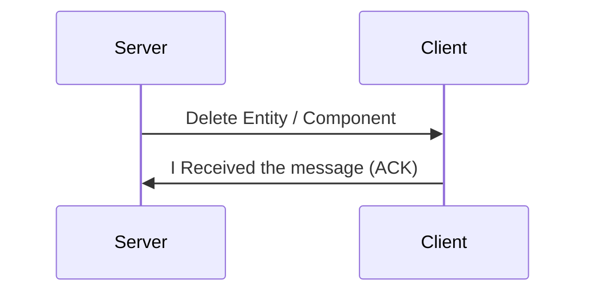
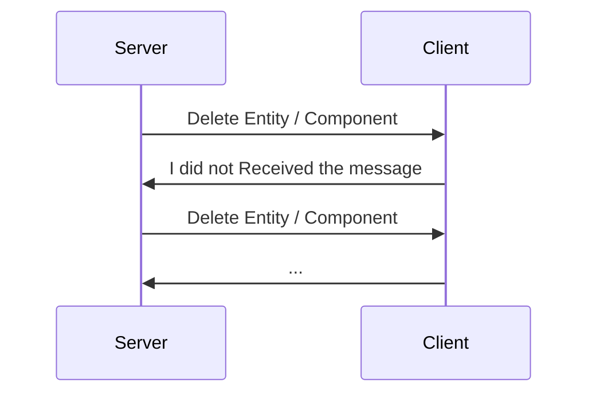
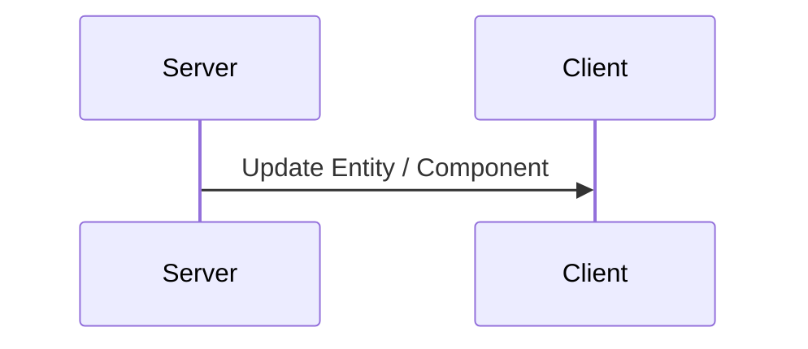

# R-Type Game Network Protocol

This document outlines the design and implementation of a custom UDP-based protocol for the R-Type game. The protocol ensures low-latency transmission of game data while providing reliability for critical events. The protocol begins with a connection phase that mimics TCP over UDP, followed by efficient handling of game state data and guaranteed delivery for essential information. The implementation utilizes the **ASIO** C++ library for asynchronous I/O operations.

---

## Table of Contents

1. [Connection Establishement](#1-connection-establishment)
    - [Encrypted Handshake](#encrypted-handshake)
    - [Connection Handshake Example](#connection-handshake-example)
2. [Data Transmission](#2-data-transmission)
    - [Game Data Packet Structure](#game-data-packet-structure)
    - [Critical Event Transmission](#12-critical-event-transmission)
    - [Critical Event Packet Structure](#critical-event-packet-structure)
3. [Reliability Mechanisms](#2-reliability-mechanisms)
    - [Packet Acknowledgment](#21-packet-acknowledgment)
    - [Retransmission Strategy](#22-retransmission-strategy)
    - [Events Answers](#23-events-answers)
        - [Movements](#movements)
        - [Entity Movement](#entity-movement)
        - [Creation of an Entity / Component](#creation-of-an-entity--component)
        - [Deletion of an Entity / Component](#deletion-of-an-entity--component)
        - [Update Entity / Component](#update-entity--component)
4. [Conclusion](#3-conclusion)
5. [Main documentation](Readme.md)


## 1. Connection Establishment

Although the game operates over UDP, the connection phase is designed to resemble TCP's 3-way handshake to ensure that both the client and server acknowledge each other before proceeding with game data transmission. **ASIO** is used to manage asynchronous sending and receiving of these messages.

#### Encrypted Handshake

To ensure the connection is secure from unauthorized access, the handshake process is encrypted using **bcrypt**. This ensures that the client and server exchange data securely and that only authorized clients can establish a connection.

The encrypted handshake process is as follows:

1. **Client sends SYN**: The client initiates a connection request by sending a SYN message to the server.
2. **Server responds with SYN-ACK**: The server generates a challenge (a cryptographic nonce or hash) and responds with a SYN-ACK.
3. **Client sends encrypted ACK**: The client hashes the challenge using bcrypt (or equivalent) and sends the encrypted ACK message to the server.
4. **Server validates ACK**: The server verifies the hash to ensure the client has the correct credentials, completing the handshake securely.

This encryption ensures that the connection setup is secure from the beginning, protecting the game from potential security risks, such as unauthorized access or man-in-the-middle attacks.

#### Connection Handshake Example

| Step | Message       | Description                                                       |
| ---- | ------------- | ----------------------------------------------------------------- |
| 1    | SYN           | Client initiates connection                                       |
| 2    | SYN-ACK       | Server acknowledges connection and sends cryptographic challenge  |
| 3    | Encrypted ACK | Client responds with an encrypted hash using bcrypt               |
| 4    | Validate ACK  | Server validates the encrypted response, completing the handshake |

### 1.1 Data Transmission

After the connection is established, the game data is transmitted over UDP using **ASIO** to handle asynchronous communication. Game data includes player positions, actions, enemy spawns, and environment updates. These packets are sent frequently and are designed to tolerate packet loss, as minor data loss does not significantly impact the game's experience.

The message structure is composed of two parts: the **header** and the **body**. The header contains important metadata such as:

- **Transaction ID (TID)**: A unique identifier for the message.
- **Size**: The size of the message in bytes.

The body contains the actual game data, and its size can vary depending on the message being transmitted.

#### Game Data Packet Structure

| Field | Size     | Description                      |
| ----- | -------- | -------------------------------- |
| TID   | 4 bytes  | Unique identifier for the packet |
| Size  | 4 bytes  | Size of the packet in bytes      |
| Body  | Variable | Game state data                  |

### 1.2 Critical Event Transmission

Certain game events are too important to risk losing due to packet loss. These include events like:

- An entity has been created
- An entity has been destroyed
- A player dying
- Boss spawning
- Game ending

For these critical events, we employ a retransmission mechanism until the server confirms that all clients have successfully received the message.

#### Critical Event Packet Structure

| Field        | Size     | Description                          |
|--------------|----------|--------------------------------------|
| Header->TID   | 4 bytes  | Type of event (e.g., player death)    |
| Body   | Variable | Struct that contains the entityId and data specific to the event            |

1. **Event Sent**: The server sends the event packet to all clients.
2. **Client ACK**: Each client sends an acknowledgment (ACK) back to the server.
3. **Retransmit if necessary**: If the server does not receive an ACK from a client, it will retransmit the event until the ACK is received.

#### Critical Event Example

| Step | Message       | Description                                       |
| ---- | ------------- | ------------------------------------------------- |
| 1    | Event (Death) | Server sends player death event                   |
| 2    | ACK           | Client acknowledges the event                     |
| 3    | Retransmit    | If ACK not received, server retransmits the event |

## 2. Reliability Mechanisms

### 2.1 Packet Acknowledgment

For critical game events, the protocol requires clients to acknowledge receipt of important packets. The server keeps track of these acknowledgments and retransmits if necessary.

### 2.2 Retransmission Strategy

- **Timeout-Based Retransmission**: The server uses a timeout mechanism to determine if a packet needs to be retransmitted. If no acknowledgment is received within the timeout window, the packet is retransmitted.
- **Max Retransmissions**: To avoid excessive retransmissions, a maximum number of attempts is set. After this, the server logs an error and may take corrective actions, such as notifying the client of a disconnection.


### 2.3 Events Answers
Here is the struct of the Message that the server and the client will exchange, and the T (template) id in the MessageHeader will be one of the enum value given below.

```cpp
template <typename T> struct MessageHeader {
  T id{};
  uint32_t size = 0;
};

template <typename T> struct Message {
  MessageHeader<T> header{};
  std::vector<uint8_t> body;
};
```

## Movements
```cpp
enum class NetworkMessages : uint32_t {
  MoveUp,
  MoveDown,
  MoveLeft,
  MoveRight
};
```



In this case the server Does not respond (because we can have the information in the next update if the packet has been lost in a transaction)

### Entity Movement

```cpp
message.header.id = NetworkMessages::MoveUp
// OR
message.header.id = NetworkMessages::MoveDown
// OR
message.header.id = NetworkMessages::MoveRight
// OR
message.header.id = NetworkMessages::MoveLeft

// I know that is not the way it works to put data into the body but it's just to simplify things

body = entityId // cast into uint8_t
```

#

## Creation of an Entity / Component

```cpp
enum class NetworkMessages : uint32_t {
  createEntity,
  createTexture,
  createPosition,
  createVelocity,
  createHealth,
  createDamage,
  createHitbox,
  createMusic,
  createSound,
  createSprite,
  createTransform,
  createBackground,
  createScroll,
  createParent
};
```

### FIRST CASE (No packet loss):


### SECOND CASE (Packet loss):



```cpp
message.header.id = NetworkMessages::createEntity
// OR
message.header.id = NetworkMessages::createTexture
// OR
message.header.id = NetworkMessages::createPosition
// OR
message.header.id = NetworkMessages::createVelocity
// OR
message.header.id = NetworkMessages::createHealth
// OR
message.header.id = NetworkMessages::createDamage
// OR
message.header.id = NetworkMessages::createHitbox
// OR
message.header.id = NetworkMessages::createMusic
// OR
message.header.id = NetworkMessages::createSound
// OR
message.header.id = NetworkMessages::createSprite
// OR
message.header.id = NetworkMessages::createTransform
// OR
message.header.id = NetworkMessages::createBackground
// OR
message.header.id = NetworkMessages::createScroll
// OR
message.header.id = NetworkMessages::createParent

// I know that is not the way it works to put data into the body but it's just to simplify things

body = entityId, {struct message.header.id} // cast into uint8_t

```

#

## Deletion of an Entity / Component
```cpp
enum class NetworkMessages : uint32_t {
  destroyEntity,
  deleteTexture,
  deletePosition,
  deleteVelocity,
  deleteHealth,
  deleteDamage,
  deleteHitbox,
  deleteMusic,
  deleteSound,
  deleteSprite,
  deleteTransform,
  deleteBackground,
  deleteScroll,
  deleteParent
};
```

### FIRST CASE (No packet loss):



```cpp
message.header.id = NetworkMessages::destroyEntity
// OR
message.header.id = NetworkMessages::deleteTexture
// OR
message.header.id = NetworkMessages::deletePosition
// OR
message.header.id = NetworkMessages::deleteVelocity
// OR
message.header.id = NetworkMessages::deleteHealth
// OR
message.header.id = NetworkMessages::deleteDamage
// OR
message.header.id = NetworkMessages::deleteHitbox
// OR
message.header.id = NetworkMessages::deleteMusic
// OR
message.header.id = NetworkMessages::deleteSound
// OR
message.header.id = NetworkMessages::deleteSprite
// OR
message.header.id = NetworkMessages::deleteTransform
// OR
message.header.id = NetworkMessages::deleteBackground
// OR
message.header.id = NetworkMessages::deleteScroll
// OR
message.header.id = NetworkMessages::deleteParent

// I know that is not the way it works to put data into the body but it's just to simplify things

body = entityId, {struct message.header.id} // cast into uint8_t
```

### SECOND CASE (Packet loss):



### [Reference case](#first-case-no-packet-loss-1)

#

## Update Entity / Component
```cpp
enum class NetworkMessages : uint32_t {
  updateEntity,
  updateTexture,
  updatePosition,
  updateVelocity,
  updateHealth,
  updateDamage,
  updateHitbox,
  updateMusic,
  updateSound,
  updateSprite,
  updateTransform,
  updateBackground,
  updateScroll,
  updateParent
};
```



In this case the server Does not respond (because we can have the information in the next update if the packet has been lost in a transaction)

```cpp
message.header.id = NetworkMessages::updateEntity
// OR
message.header.id = NetworkMessages::updateTexture
// OR
message.header.id = NetworkMessages::updatePosition
// OR
message.header.id = NetworkMessages::updateVelocity
// OR
message.header.id = NetworkMessages::updateHealth
// OR
message.header.id = NetworkMessages::updateDamage
// OR
message.header.id = NetworkMessages::updateHitbox
// OR
message.header.id = NetworkMessages::updateMusic
// OR
message.header.id = NetworkMessages::updateSound
// OR
message.header.id = NetworkMessages::updateSprite
// OR
message.header.id = NetworkMessages::updateTransform
// OR
message.header.id = NetworkMessages::updateBackground
// OR
message.header.id = NetworkMessages::updateScroll
// OR
message.header.id = NetworkMessages::updateParent

// I know that is not the way it works to put data into the body but it's just to simplify things

body = entityId, {struct message.header.id} // cast into uint8_t
```

#

## 3. Conclusion

This UDP-based protocol, implemented with the **ASIO** C++ library, balances the need for speed with the requirement for reliability in critical moments. While game state updates are transmitted without guarantees, important events are handled with care to ensure consistency across all clients. The use of a priority field in the message header ensures that critical information is delivered with precedence. This design allows for a fluid and responsive multiplayer experience while maintaining the integrity of essential game events.

#

Go to the main documentation : [Main documentation](Readme.md)
